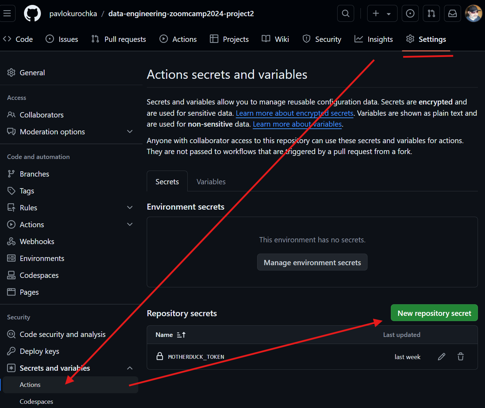

# GithHub Actions configuration

GiotHub Actions is a alternative free orchestration. It is configured to run daily on GiotHub codespace. It runs for less then 2 min per day and easily fits in the free-use codespaces limit.

## Add Repo Secrets

Notice in the data-pipeline.yml file I referenced a variable, e.g., *${{ secrets.MOTHERDUCK_TOKEN }}*.

It is one of the  **repository secrets** that are accessible to GitHub Actions as environment variables. To create them, we go to our repository settings, click Secrets and Variables, select Actions, and click “New repository secret”.

Add a value for MOTHERDUCK_TOKEN. Check main [readme](README.md) on how to get it.

## Orchestration

[Workflow](.github/workflows/data-pipeline.yml).is configured in a YAML file, similar to Kestra.

It runs two Python scripts: `create_secrets.py` and  `run_backfill.py`. After that it runs SQLMesh.

