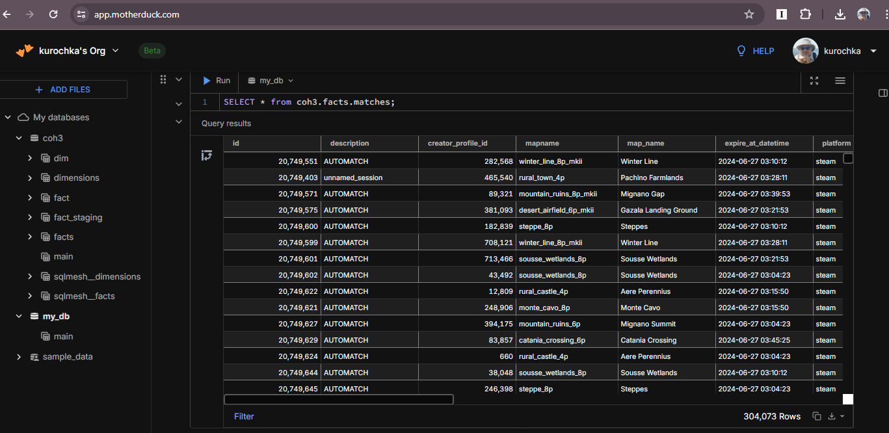
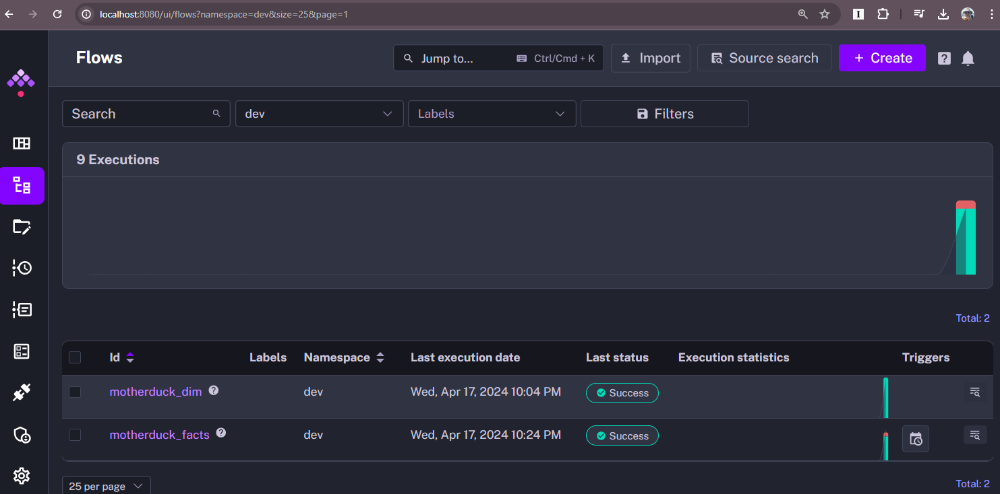
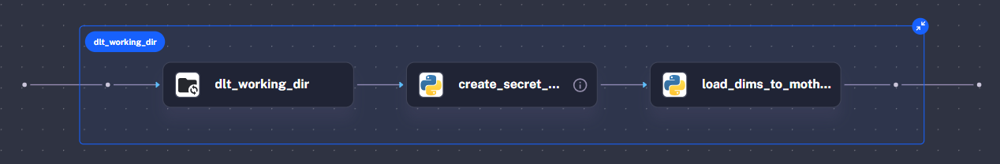
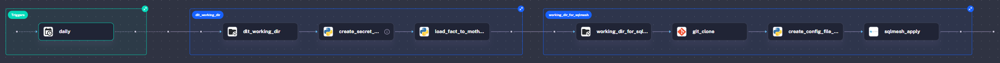
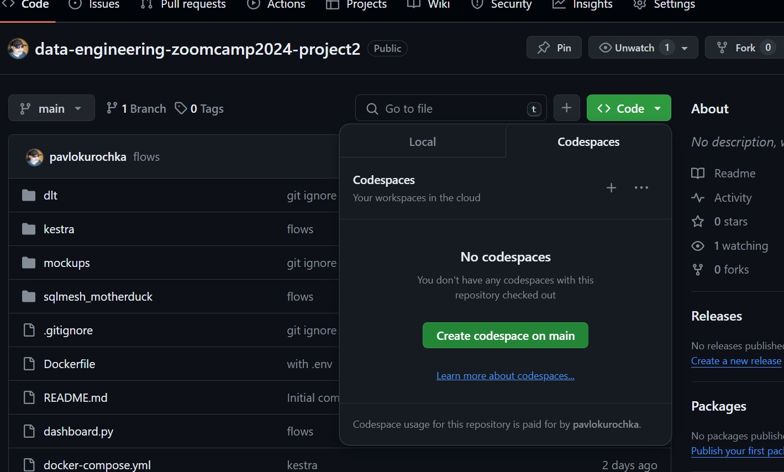
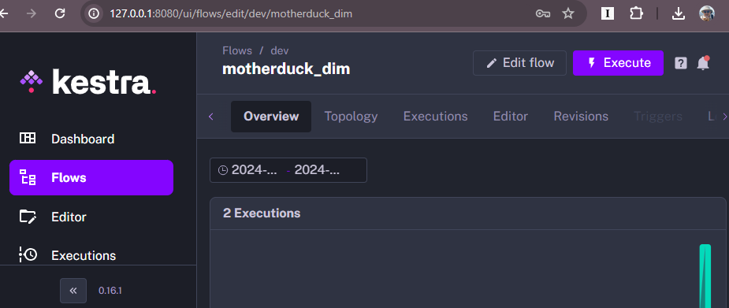
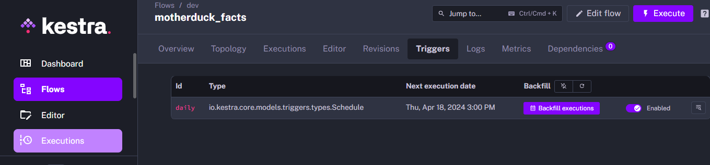
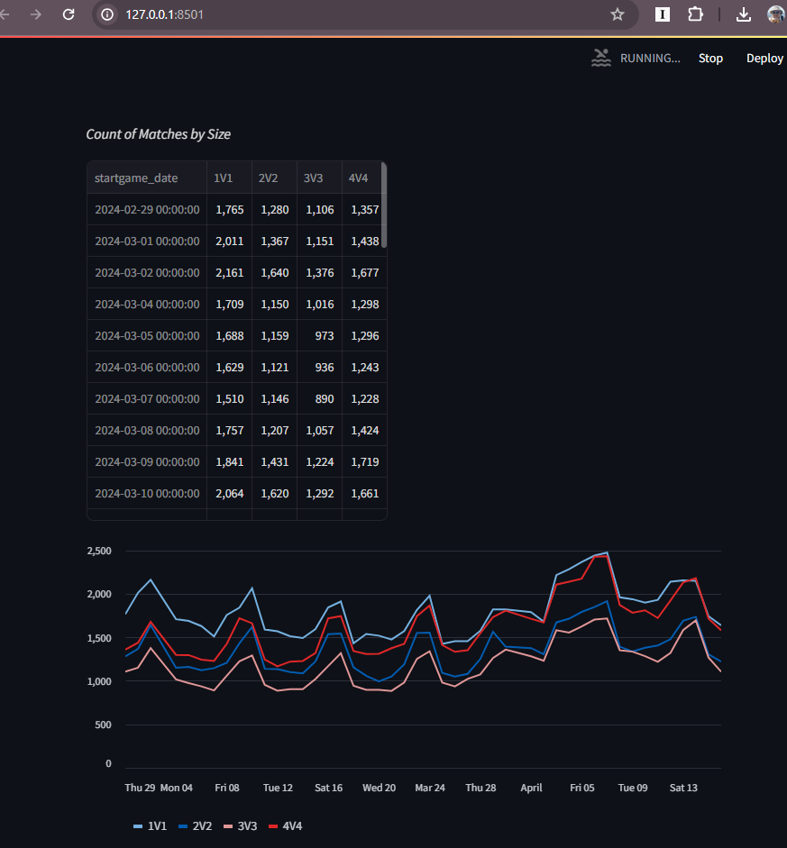

# Lightweight Data Pipeline for Company of  Heroes 3 Matches

### Introduction

This is the a second final project for [Data Engineering Zoomcamp 2024](https://github.com/DataTalksClub/data-engineering-zoomcamp). My first project is already accepted. While doing the peer review grading of the submissions by my fellow students, I ran across the [project](https://github.com/KevsDe/de_aoe2_games_data_pipeline) that transformed match stats for **Age of Empires 2**, which was my favorite game long time ago. This inspired me to start figuring out how to do something similar with the data from my current favorite game [Company of  Heroes 3](https://community.companyofheroes.com/coh-franchise-home/company-of-heroes-3). It turns out the enthusiasts behind [coh3stats](https://coh3stats.com/stats/games) already did the best dashboards I could imagine. However, I thought that there could always be more queries to be run to explore data from some other angle. And while coh3stats guys do store and [expose raw data](https://coh3stats.com/other/open-data), I got the impression that the format is not very data analyst friendly.

### Problem description

This is a proof-of-concept project to build a lightweight and free data engineering infrastructure that would execute a pipeline from downloaded datasets to an analytical dashboard. It stores data in the free data warehouse from MotherDuck which could be easily queried with MotherDuck online [UI](https://app.motherduck.com/) (pictured below) or tools like [Dbeaver](https://motherduck.com/docs/integrations/dbeaver).



We download **fact** data as daily JSON filles with data for multiplayer matches that are stored at [storage.coh3stats.com](https://coh3stats.com/other/open-data). I asked around about **dimensions** data on coh3stats Discord and got pointers to some [source](https://github.com/cohstats/coh3-stats/blob/master/src/coh3/coh3-raw-data.ts) [code](https://github.com/cohstats/coh3-stats/blob/master/src/coh3/coh3-data.ts) in their repo. I copied them into [coh3-raw-data.yaml](dlt/coh3-raw-data.yaml).

### Technologies

- **Cloud**: [GitHub codespaces](https://github.com/codespaces).

- **Infrastructure as code (IaC)**: Docker.

- **Workflow orchestration**: [Kestra](https://kestra.io/).

- **Data Warehouse**: [MotherDuck](https://app.motherduck.com/)

- **Batch processing**: [SQLMesh](https://sqlmesh.com/), [dlt](https://dlthub.com/), Python.

- **Dashboard**: [Strimlit](https://cheat-sheet.streamlit.app/)

### Data ingestion (batch) & Workflow orchestration

We have two pipelines run in a Kestra flows in a Kestra docker container that runs on a GitHub codespace.



Flow **motherduck_dim** transforms dimension data from [coh3-raw-data.yaml](dlt/coh3-raw-data.yaml) into tables in MotherDuck.



#### Transformation  tasks description

- **create_secret_file** creates secrets.toml file to provide dlt with MotherDuck token. Downloads python file for the next task.
- **load_dims_to_motheduck**  processes dimension data with dlt and loads into MotherDuck.

Flow **motherduck_facts** transforms fact data data for game matches from [storage.coh3stats.com](https://coh3stats.com/other/open-data) for a given day and loads into tables in MotherDuck.



#### Transformation  tasks description

- **create_secret_file** creates `secrets.toml` file to provide **dlt** with MotherDuck token. Downloads python file for the next task.
- **load_fact_to_motheduck**  processes (normalizes) fact data with dlt and loads into MotherDuck.
- **git_clone** clones this repo into working directory
- **create_config_file_with_secret**  creates `config.yaml` file to provide **SQLMesh** with MotherDuck token.
- **sqlmesh_apply** runs SQL transformations in **SQLmesh**.

**NOTE**: you can check out the flow scripts inside: `kestra\flows.zip`.

### Transformations (SQLMesh, dlt, Python.)

- Used Python with **dlt** to notmalise and SQLMesh to create staging views and finally a fact view named matches_by_size.

### Dashboard

- Simple Python script with Strimlit. Runs in Docker container.

------


## How to reproduce the project

### Setup Cloud

Create and account on [MotherDuck](https://app.motherduck.com/). Go to [settings](https://app.motherduck.com/settings) and copy the Service Token.

Fork this repository to your GitHub account. Click on **Code** and the **Create codespace on main**.



Select File> Run in VC Code Desktop. Now you have a code editor, terminals and port forwarding all set up for you.


### Configure Secrets

In VS Code create `.env` file in the project directory.


Paste following lines into it:

```bash
MOTHERDUCK_TOKEN=REPLACE_WITH_MOTHERDUCK_TOKEN
COMPOSE_CONVERT_WINDOWS_PATHS=1
```

Paste the MotherDuck token into the file. Then run these commands in the terminal. This will create .`env_encoded` file that is a proper way to pass secrets into Kestra Docker container. Watch Michael Shoemaker's Kestra [videos](https://youtu.be/Jfa4jtLOnIs?si=mLKYH7eP6sxC88-1) for explanation.

```bash
chmod +x encode_env_vars.sh
./encode_env_vars.sh
```

Now we are ready to start Kestra Docker container.

```bash
docker compose up
```


### Execute Kestra Flows

Open http://127.0.0.1:8080/ in your local browser. **User name** and **password** are in [docker-compose.yml](docker-compose.yml)

Go to **Flows**>**motherduck_dim** and click on **Execute**. Wait for the flow to complete.



Go to **Flows**>**motherduck_facts**>**Triggers** and click on **Backfill executions.** Select a date range from a month ago to yesterday. Click on Execute Backfill  Wait for the flow to complete.



### Dashboard

Open a new terminal in VS Code. Build and run a Docker container for the Sreamlit dashboard.

```bash
docker build -t streamlit .
docker run --env-file=.env -p 8501:8501 streamlit
```

Open http://127.0.0.1:8501/ in your local browser.



### Cleanup

Kill all open terminals in VS Code. Stop your codespace in [codespaces](https://github.com/codespaces).

------

I hope you like it. If you have any questions about the project, face any problems while following along, or have a suggestion for me, feel free to comment or drop me a DM on  [Linkedin](https://www.linkedin.com/in/kurochka/).

### Special thanks 

Kevin Careaga for [de_aoe2_games_data_pipeline](https://github.com/KevsDe/de_aoe2_games_data_pipeline) - the inspiration.

Folks behind https://coh3stats.com/ for data and codes.

**@pagep** from  COH stats Discord for showing me the way to the codes.